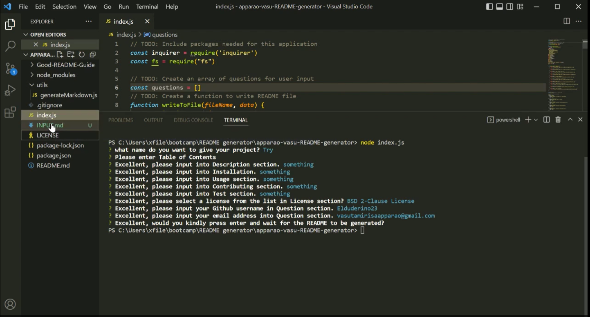
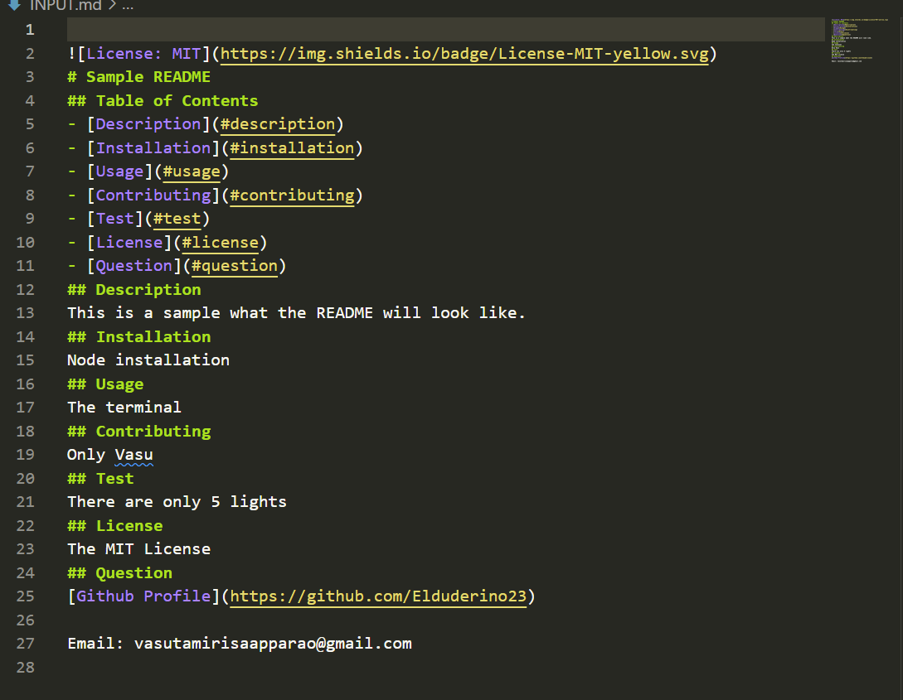
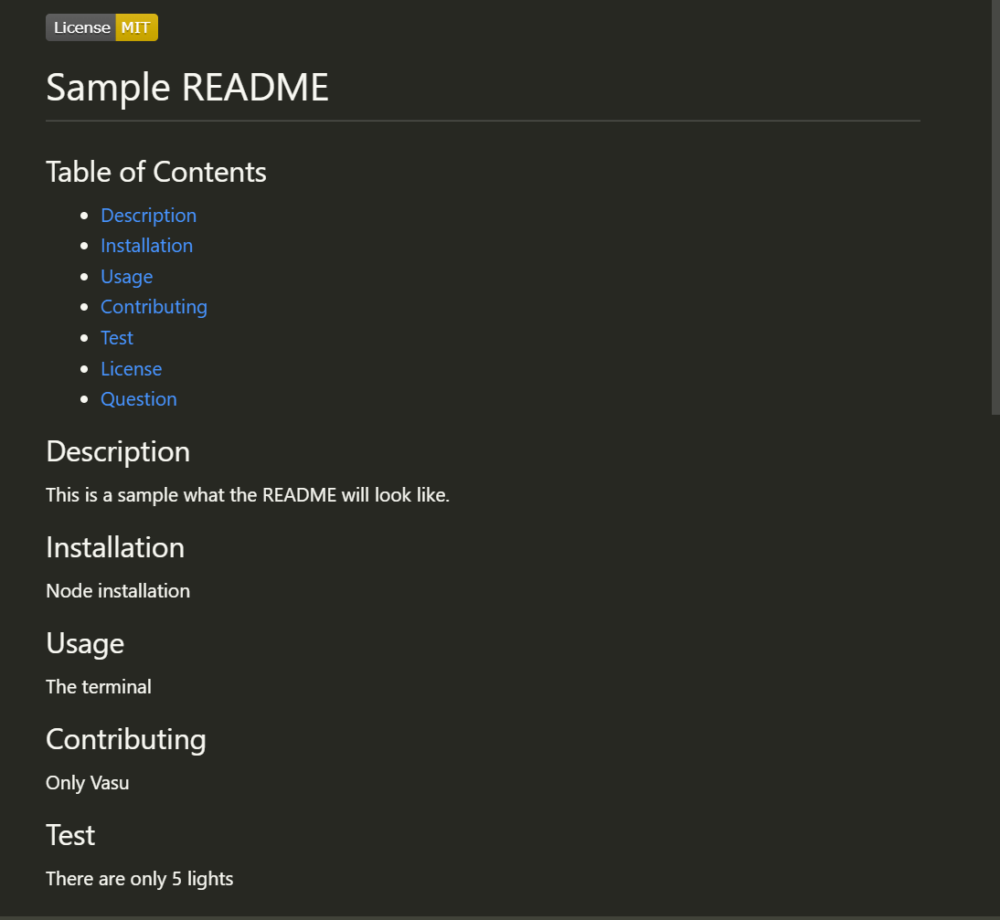

# README Generator

## Video Link

https://watch.screencastify.com/v/yWZs1QtDcZFrxVbZeixR

## Goal
The task was use Node.js and Inquirer.js to create a README Generator that produce a README.md in full markdown, have clickable sections in Table of Contents that would direct the user to go to each section of the README, generate a license badge on the top part of the markdown based on selection of license the user selects, a series of prompts the user would answer based on input, a link to a GitHub profile based on the user's input of a Github profile, an inputting email into the generated README.md, and the generated README to update itself when a new input is put in. 

## Technology Use
  - Node.js
  - Inquirer.js
  - JQuery
  - VS Code
  - Git Bash 
  - GitHub

## Execution
The first part of making the README generator was to make the questions. I was relatively easy because the documentation behind Inquirer.js provided several prompt templates to use the README generator. It broke down into three catagories: name, message, and type. Message allows any question to pop up, name acts similar to ids in HTML formats, and type for what kind of response does the user encounter. For example, if the developer wants the user to make a yes or no response, there is type: confirm.
If the developer wants the user to input any words there is type: input.

The type: input used to generate questions is  the prompt shown below:

```Javascript
{

}, {
    name: "Description", 
    message: "Excellent, please input into Description section.",
    type: "input",
}
```
When the user encounters the question, what ever they type into the input field will be generated. It is the same for the other ten questions. The prompts were only possible with a function called "function init()". 

The second part of was to make the generation of a new file possible. Luckily the Inquirer.js documentation showed that in order to make it happen is use the module require for file system, fs for short.

The set up is shown below:

```Javascript
const inquirer = require('inquirer')
const fs = require("fs") 

function writeToFile(fileName, data) {
    fs.writeFileSync(fileName, data);
}
```
The require module summons both fs and inquirer in their respective spots and that helps Node.js create a file in the first place. The function writeToFile pulls the data from the user generation inputs as well to start the file creation. The real meat and potatoes starts with both functions generalMarkdown and generateLicenseBadge.

Both functions are shown below:

```Javascript
function generateMarkdown(data){
   var badge = generateLicenseBadge(data)
    return `
${badge}
# ${data.Opening}
## Table of Contents
- [Description](#description)
- [Installation](#installation)
- [Usage](#usage)
- [Contributing](#contributing)
- [Test](#test)
- [License](#license)
- [Question](#question)
## Description
${data.Description}
## Installation
${data.Installation}
## Usage
${data.Usage}
## Contributing
${data.Contributing}
## Test
${data.Test}
## License
${data.License}
## Question
[Github Profile](https://github.com/${data.GitHub})

Email: ${data.Email}
`
}

function generateLicenseBadge(data){
    if (data.License === "Apache") {
        return ""
    }

    if (data.License === "Boost") {
        return ""
    }

    if (data.License === "BSD 3-Clause License") {
        return ""
    }

    if (data.License === "BSD 2-Clause License") {
        return ""
    }

    if (data.License === "Creative Commons") {
        return ""
    }

    if (data.License === "Eclipse Public License 1.0") {
        return ""
    }

    if (data.License === "GNU") {
        return ""
    }

    if (data.License === "Mozilla Public License 2.0") {
        return ""
    }

    if (data.License === "The MIT License") {
        return ""
    }

    if (data.License === "The Unlicense") {
        return ""
    }
}

 ```
generateMarkdown functions helps sets up the markdown necessary to be put inside the hollow markdown file, called INPUT.md. User generated magic starts with ${data.(name)}. Replace name with the sections like Installation or Usage, whatever the user puts in each of their respective sections. The other function, generateLicense, allows the creation of a license badge based on the user's selection of license badges to show up on the top part of the generated README. For example, if the user chooses the MIT license, then the MIT License badge will generate on top of the INPUT.md, the shell markdown file that generates markdown based on user input. There is on last piece of the puzzle for this code and that is the then statement that ties generateMarkdown to writeToFile. Without this section, there would be nothing to generate no matter how many times the user types "node index.js"

the part is shown below:

```Javascript
}]).then(function(data){
    var markDown = generateMarkdown(data)
    writeToFile("INPUT.md", markDown);
    // console.log(data)
})
```
## Result

The following application demonstrates what the final product looks like:
The application in the terminal

the markdown

the final look


<!-- ## Your Task

When creating an open source project on GitHub, it’s important to have a high-quality README for the app. This should include what the app is for, how to use the app, how to install it, how to report issues, and how to make contributions&mdash;this last part increases the likelihood that other developers will contribute to the success of the project. 

You can quickly and easily create a README file by using a command-line application to generate one. This allows the project creator to devote more time to working on the project.

Your task is to create a command-line application that dynamically generates a professional README.md file from a user's input using the [Inquirer package](https://www.npmjs.com/package/inquirer). Review the [Good README Guide](./Good-README-Guide/README.md) as a reminder of everything that a high-quality, professional README should contain. 

The application will be invoked by using the following command:

```bash
node index.js
```

Because this application won’t be deployed, you’ll also need to provide a link to a walkthrough video that demonstrates its functionality. Revisit the Screencastify Tutorial in the prework as a refresher on how to record video from your computer. You’ll need to submit a link to the video _and_ add it to the README of your project.


## User Story

```md
AS A developer
I WANT a README generator
SO THAT I can quickly create a professional README for a new project
```

## Acceptance Criteria

```md
GIVEN a command-line application that accepts user input
WHEN I am prompted for information about my application repository
THEN a high-quality, professional README.md is generated with the title of my project and sections entitled Description, Table of Contents, Installation, Usage, License, Contributing, Tests, and Questions
WHEN I enter my project title
THEN this is displayed as the title of the README
WHEN I enter a description, installation instructions, usage information, contribution guidelines, and test instructions
THEN this information is added to the sections of the README entitled Description, Installation, Usage, Contributing, and Tests
WHEN I choose a license for my application from a list of options
THEN a badge for that license is added near the top of the README and a notice is added to the section of the README entitled License that explains which license the application is covered under
WHEN I enter my GitHub username
THEN this is added to the section of the README entitled Questions, with a link to my GitHub profile
WHEN I enter my email address
THEN this is added to the section of the README entitled Questions, with instructions on how to reach me with additional questions
WHEN I click on the links in the Table of Contents
THEN I am taken to the corresponding section of the README
```

## Getting Started

Here are some guidelines to help you get started:

* Create a `.gitignore` file and include `node_modules/` and `.DS_Store/` so that your `node_modules` directory isn't tracked or uploaded to GitHub. Be sure to create your `.gitignore` file before installing any npm dependencies.

* Make sure that your repo includes a `package.json` with the required dependencies. You can create one by running `npm init` when you first set up the project, before installing any dependencies.

* Include a video of the typical user flow through your application. This includes views of the prompts and the responses after their selection.

* Include any other screenshots you deem necessary to help someone who has never been introduced to your application understand the purpose and function of it. This is how you will communicate to potential employers or other developers in the future what you built and why, and to show how it works.

## Grading Requirements

This Challenge is graded based on the following criteria: 

### Deliverables: 20%

* A sample README generated using the application must be submitted.

* Your GitHub repository containing your application code.

### Walkthrough Video: 27%

* A walkthrough video that demonstrates the functionality of the README generator must be submitted, and a link to the video should be included in your README file.

* The walkthrough video must demonstrate how a user would invoke the application from the command line.

* The walkthrough video must demonstrate how a user would enter responses to all of the prompts in the application.

* The walkthrough video must demonstrate a generated README that matches the user input and has a functioning table of contents.

### Technical Acceptance Criteria: 40%

* Satisfies all of the above acceptance criteria plus the following:

	* Uses the [Inquirer package](https://www.npmjs.com/package/inquirer).

### Repository Quality: 13%

* Repository has a unique name.

* Repository follows best practices for file structure and naming conventions.

* Repository follows best practices for class/id naming conventions, indentation, quality comments, etc.

* Repository contains multiple descriptive commit messages.

* Repository contains a high-quality README with description and a link to walkthrough video.


## Review

You are required to submit the following for review:

* A walkthrough video demonstrating the functionality of the application.

* A sample README.md file for a project repository generated using your application

* The URL of the GitHub repository, with a unique name and a README describing the project

---

© 2022 Trilogy Education Services, LLC, a 2U, Inc. brand. Confidential and Proprietary. All Rights Reserved. -->
